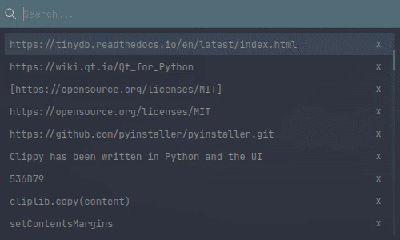

# Clippy
Clippy is a sleek & modern clipboard manager written in Python using the Qt Framework alongside `PySideX`. It aims to solve a commonly encountered ergonomic issue when copying content into the clipboard by provides a set of ergonomic tools & utilities to, store, manage & filter through your clipboard virtual history. Clippy listens to your operating system's defualt clipbaord daemon, when it detects content change, the `clipEvent` gets triggered, then the content of the clipboard gets added as a new entry to the history and ultimately pushed to a local database.

<p align="center">
  
</p>

## Getting Started
+ Head to `releases`, then selected and download the approriate binary
depending on your Operating System.
+ Or, you could clone this repo on your machine using:
```bash
$ > git clone https://github.com/QuaeriteVeritatis/Clippy && cd ./Clippy
```
Install the dependencies:
```bash
$ > pip3 install -r requirements.txt
```
Then run it as is:
```bash
$ > python3 ./src/app.py &
```
+ Alternatively you could compile/build it from source using something like [pyinstaller](https://github.com/pyinstaller/pyinstaller.git).

## Usage
Once you've launched Clippy, you can summon the window using the shortcut `ctrl + alt + c`. Then you can filter through the history by typing in the search bar. To clear your clipboard history, you can use the shortcut `ctrl + alt + x`. Please do note that this will only empty the list displayed, not purge the database. Please visit the settings page for database & storge 
related operations.

## Setup the Daemon
> coming soon

## Features
+ Ergonomy:
    * [X] Shortcut summoning.
    * [ ] Support hyper links urls and open in browser tab.
+ Navigation:
    * [x] Browsing plain-text clipboard history and automatically pasting any selected entry to the clipboard.
    * [ ] Organize by date or filter parameters.
+ Images:
    * [ ] Image support.
    * [ ] [Imgur upload support](https://github.com/Imgur/imgurpython). 
+ Miscellaneous:
    * [ ] Export clipboard history as a plain-text file.

## TODO List
- [ ] TODO: Implement QuickTrigger (for recent clipboard, 1...9).
- [ ] TODO: Implement ShortKey (Paste preset entries).
- [ ] TODO: Implement Settings Page.
- [ ] TODO: Implement `clipManager.ClipManager.processPixmap`.
- [ ] TODO: Implement `clipManager.ClipManager.processImage`.

- [X] DONE: ReImplement the Clipboard logic using `QApplication.clipboard()`, it supports images too.
- [X] DONE: Save history locally on the machine. Using [TinyDB](https://tinydb.readthedocs.io/en/latest/index.html) as a DB backend.
- [X] DONE: Added a self destruct button to each ClipWidget by passing a referecence to the item and parent (app), and calling the `removeClipWidget` method.
- [X] DONE: Mess around with the Qt.Popup flag/type to make the window dissapear and fallback to tray upon losing focus.
- [x] DONE: Make the app globally summonable.
- [x] DONE: Listen to clipboard events and add new entries to the stack.
- [x] DONE: Move selection to the top of the stack upon double click if it's different from the current top of the stack.
- [x] DONE: Notify when operation has been performed on the clipboard.
- [x] DONE: Implemented Shortcuts (not globally) Clear, Last, Grab, Quit.
- [x] DONE: Search bar to filter through the entries.

## Issues Reported
> ~~None so far, strange huh?~~

## Issues addressed
- [X] First element selected but not highlighted after re-summoning. 
- [X] Text overflows of custom item instead of truncating to a normalized size. *(Sort of fixed)*
- [X] Fixed: Getting the text from a QListWidget's Widget instead of the item itself.
- [X] Fixed: Notification backend conflicting between different operating systems.
- [x] Fixed: QDesktop deprecation warning by replacing `QApplication.desktop().screenNumber` with `QGuiApplication.screenAt(QApplication.desktop())`.

# Support
+ On Windows, no additional modules are needed.

+ On Mac, the pyobjc module is used, falling back to the pbcopy and pbpaste cli
    commands. (These commands should come with OS X.).

+ On Linux, install xclip, xsel, or wl-clipboard (for "wayland" sessions) via package manager.
- For example, in Debian:
    - sudo apt-get install xclip
    - sudo apt-get install xsel
    - sudo apt-get install wl-clipboard

- Or in Arch:
    - (sudo pacman | yay) -S install xclip
    - (sudo pacman | yay) -S install xsel
    - (sudo pacman | yay) -S install wl-clipboard

Otherwise on Linux, you will need the gtk or PyQt5+/PySide2+ modules installed.

Gtk and PyQt4 modules are not available for Python 3, and this module does not work with PyGObject, and support isn't planned.
Cygwin is currently not supported.

Note: There seems to be a way to get gtk on Python 3, according to:
    https://askubuntu.com/questions/697397/python3-is-not-supporting-gtk-module
